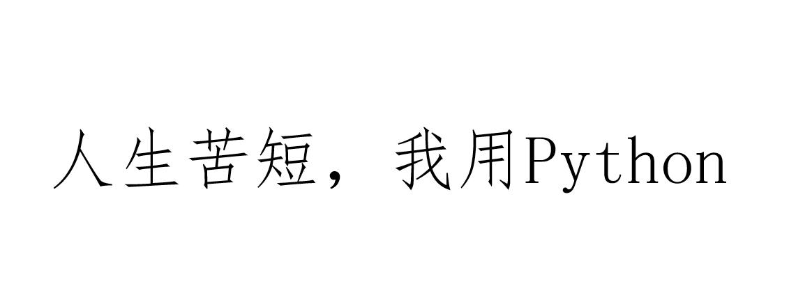
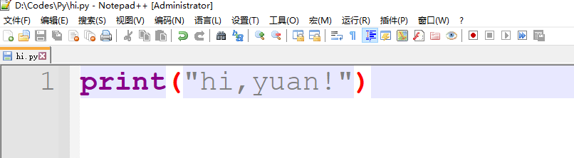
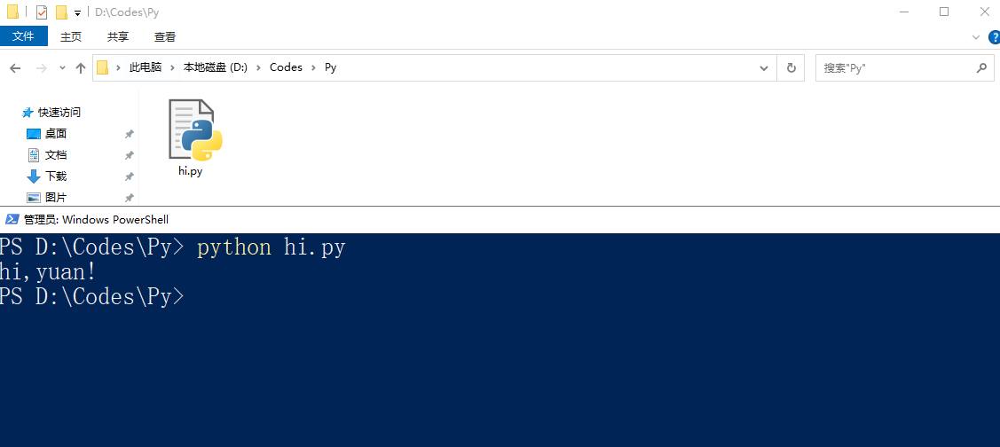
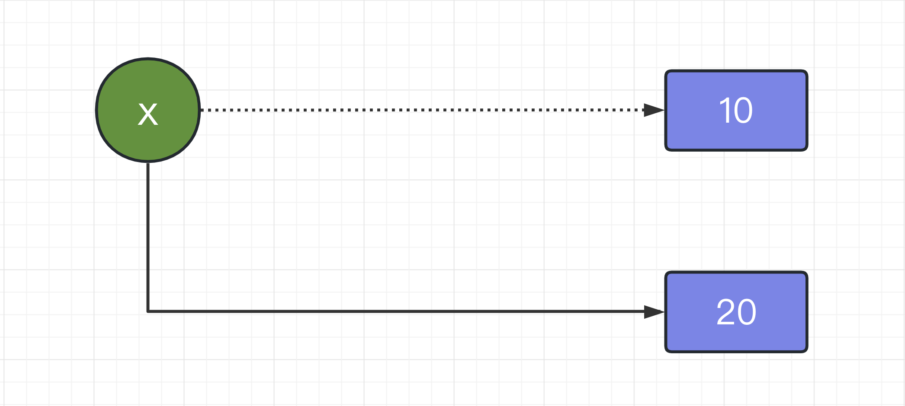
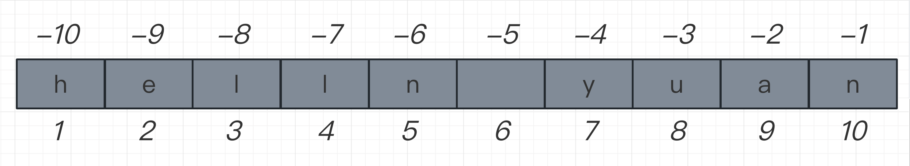
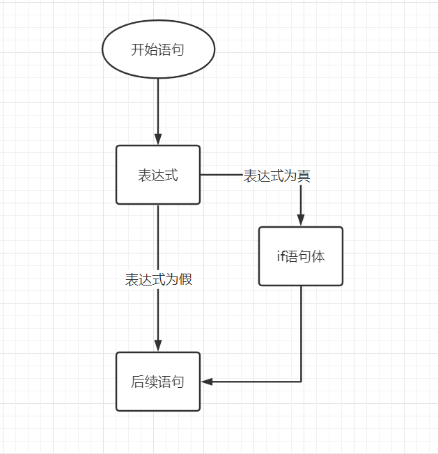
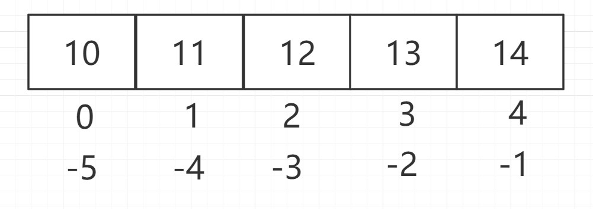
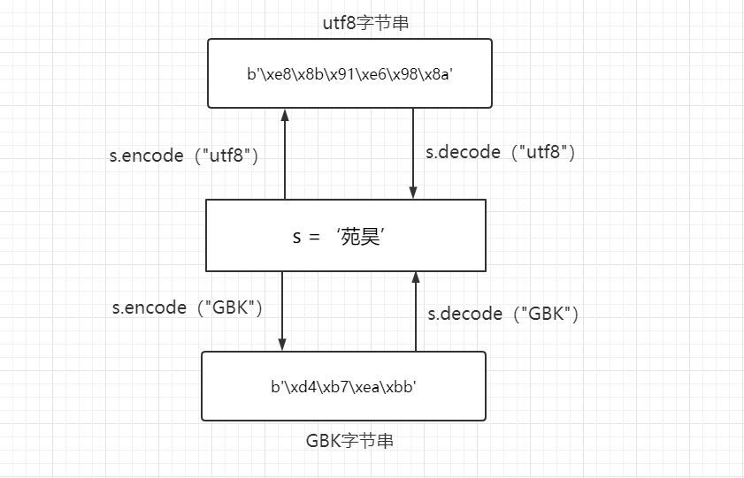
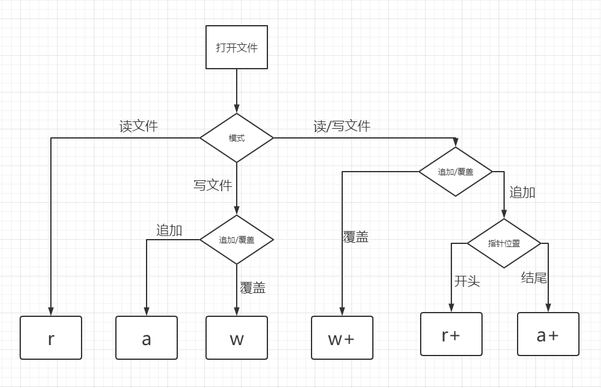
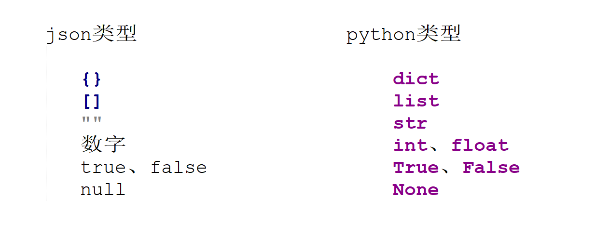

# Python基础【2023最新版】


# 一、计算机与编程语言

## 1.1、计算机的硬件组成


## 1.1、什么是编程语言

编程语言是用来控制计算机的一系列指令（Instruction），它有固定的格式和词汇（不同编程语言的格式和词汇不一样）。就像我们中国人之间沟通需要汉语，英国人沟通需要英语一样，人与计算机之间进行沟通需要一门语言作为介质，即编程语言。

编程语言的发展经历了机器语言（指令系统）=>汇编语言=>高级语言（`C、java、Go`等）。

* 计算机在设计中规定了一组指令（二级制代码），这组指令的集和就是所谓的机器指令系统，用机器指令形式编写的程序称为机器语言。
* 但由于机器语言的千上万条指令难以记忆，并且维护性和移植性都很差，所以在机器语言的基础上，人们提出了采用字符和十进制数代替二进制代码，于是产生了将机器语言符号化的汇编语言。
* 虽然汇编语言相较于机器语言简单了很多，但是汇编语言是机器指令的符号化，与机器指令存在着直接的对应关系，无论是学习还是开发，难度依然很大。所以更加接近人类语言，也更容易理解和修改的高级语言就应运而生了，高级语言的一条语法往往可以代替几条、几十条甚至几百条汇编语言的指令。因此，高级语言易学易用，通用性强，应用广泛。


## 1.2、编译型语言与解释性语言

计算机是不能理解高级语言的，更不能直接执行高级语言，它只能直接理解机器语言，所以使用任何高级语言编写的程序若想被计算机运行，都必须将其转换成计算机语言，也就是机器码。而这种转换的方式分为编译和解释两种。由此高级语言也分为编译型语言和解释型语言。


* 编译型语言

使用专门的编译器，针对特定的平台，将高级语言源代码一次性的编译成可被该平台硬件执行的机器码，并包装成该平台所能识别的可执行性程序的格式。

编译型语言写的程序执行之前，需要一个专门的编译过程，把源代码编译成机器语言的文件，如`exe`格式的文件，以后要再运行时，直接使用编译结果即可，如直接运行`exe`文件。因为只需编译一次，以后运行时不需要编译，所以编译型语言执行效率高。

> 1、一次性的编译成平台相关的机器语言文件，运行时脱离开发环境，运行效率高；
>
> 2、与特定平台相关，一般无法移植到其他平台；

* 解释型语言

使用专门的解释器对源程序逐行解释成特定平台的机器码并立即执行。是代码在执行时才被解释器一行行动态翻译和执行，而不是在执行之前就完成翻译。

> 1.解释型语言每次运行都需要将源代码解释称机器码并执行，执行效率低；
>
> 2.只要平台提供相应的解释器，就可以运行源代码，所以可以方便源程序移植；

# 二、Python语言介绍

## 2.1、了解Python语言

Python 是1989 年荷兰人 Guido van Rossum （简称 Guido）在圣诞节期间为了打发时间，发明的一门面向对象的解释性编程语言。Python来自Guido所挚爱的电视剧Monty Python's Flying Circus。


Guido对于Python的设计理念就是一门介于shell和C之间的语言。可以像shell那样，轻松高效编程，也可以像C语言那样，能够全面调用计算机的功能接口。

python的设计哲学：优雅、明确、简洁。



## 2.2、Python解释器下载与安装

Python 安装包下载地址：https://www.python.org/downloads/

安装文档：👇
https://note.youdao.com/s/2FfghK3Y（根据文档一步一步操作，肯定能安装成功的）

安装完成以后，打开 Windows 的命令行程序（命令提示符），在窗口中输入`python`命令（注意字母`p`是小写的），如果出现 Python 的版本信息，并看到命令提示符`>>>`，就说明安装成功了，如下图所示。

## 2.3、第一个Python程序

在任意位置创建一个文本文件，写下符合python语法的代码，比如`print("hi,yuan!")`



保存后在终端该路径下，通过python命令用python解释器执行该文件即可得到打印结果：

```
python python文件名
```



# 三、基础语法

## 3.1、变量

### 3.1.1、变量的使用

变量是一段有名字的连续存储空间。我们通过定义变量来申请并命名这样的存储空间，并通过变量的名字来使用这段存储空间。在编程语言中，将数据放入变量的过程叫做赋值（Assignment）。Python 使用等号`=`作为赋值运算符，具体格式为：

```
变量名 = 任意类型的值
```

例如：



```python 
x  = 10
y  = "hello,yuan"
z  = True
x  = 20
```

> python作为动态语言的代表，是不同于C语言等静态语言的变量存储原理的

```python 
x = 10
print(id(x))
x = 20  # 内存变化
print(id(x))
```

思考，为什么要用变量？

```python
# 为什么要有变量

# 案例1
a = 10
b = 20

print(a + b)
print(a - b)
print(a * b)
print(a / b)

# 案例2
text = "Hello World"
print(text)
print("Hello World".upper())
print("Hello World".lower())

```

### 3.1.2、变量命名规范

简单地理解，标识符就是一个名字，就好像我们每个人都有属于自己的名字，它的主要作用就是作为变量、函数、类、模块以及其他对象的名称。Python中标识符的命名不是随意的，而是要遵守一定的命令规则

> * 标识符是由字符（A~Z 和 a~z）、下划线和数字组成，但第一个字符不能是数字。
> * 标识符不能和 Python 中的保留字相同。有关保留字，后续章节会详细介绍。
> * Python中的标识符中，不能包含空格、@、% 以及 $ 等特殊字符。
> * 在 Python 中，标识符中的字母是严格区分大小写
> * Python 允许使用汉字作为标识符（不推荐）

| and   | as   | assert | break    | class  | continue |
| ----- | ---- | ------ | -------- | ------ | -------- |
| def   | del  | elif   | else     | except | finally  |
| for   | from | False  | global   | if     | import   |
| in    | is   | lambda | nonlocal | not    | None     |
| or    | pass | raise  | return   | try    | True     |
| while | with | yield  |          |        |          |

## 3.2、基本语法

#### （1）注释

注释就是对代码的解释和[说明](https://baike.baidu.com/item/说明/39260)，其目的是让人们能够更加轻松地了解代码。注释是编写程序时，写程序的人给一个语句、程序段、函数等的解释或提示，能提高程序代码的可读性。一般情况下，合理的代码注释应该占源代码的 1/3 左右。

> 注释只是为了提高公认阅读，不会被解释器执行。

Python 支持两种类型的注释，分别是单行注释和多行注释。

```python 
#  单行注释
"""
这是一个多行注释
三引号里面的任何内容不会被解释器执行
"""
```

#### （2）语句分隔符

就像我们写作文一样，逗号、句号等语句分隔符是非常重要的，程序也一样，要想让解释器能读懂，语句和语句之间一定要有分隔符。在C、Java等语言的语法中规定，必须以分号作为语句结束的标识。Python也支持分号，同样用于一条语句的结束标识。但在Python中分号的作用已经不像C、Java中那么重要了，Python中的分号可以省略，主要通过换行来识别语句的结束。

#### （3）缩进

和其它程序设计语言（如 [Java](http://c.biancheng.net/java/)、C 语言）采用大括号“{}”分隔代码块不同，[Python](http://c.biancheng.net/python/) 采用冒号（ : ）和代码缩进和来区分代码块之间的层次。在 Python 中，对于类定义、函数定义、流程控制语句、异常处理语句等，行尾的冒号和下一行的缩进，表示下一个代码块的开始，而缩进的结束则表示此代码块的结束。

注意，Python 中实现对代码的缩进，可以使用空格或者 Tab 键实现。但无论是手动敲空格，还是使用 Tab 键，通常情况下都是采用 4 个空格长度作为一个缩进量（默认情况下，一个 Tab 键就表示 4 个空格）。

#### （4）Python编码规范（PEP 8）

Python 采用 PEP 8 作为编码规范，其中 PEP 是 Python Enhancement Proposal（Python 增强建议书）的缩写，8 代表的是 Python 代码的样式指南。下面仅给大家列出 PEP 8 中初学者应严格遵守的一些编码规则：

> 1、不要在行尾添加分号，也不要用分号将两条命令放在同一行
>
> 2、通常情况下，在运算符两侧、函数参数之间以及逗号两侧，都建议使用空格进行分隔。
>
> 3、使用必要的空行可以增加代码的可读性，通常在顶级定义（如函数或类的定义）之间空两行，而方法定义之间空一行，另外在用于分隔某些功能的位置也可以空一行。

#### （5）输入输出函数

* **print函数**  ： 用于打印输出，是python中最常见的一个函数。

```python 
def print(self, *args, sep=' ', end='\n', file=None): # known special case of print
    """
    print(value, ..., sep=' ', end='\n', file=sys.stdout, flush=False)
    
    Prints the values to a stream, or to sys.stdout by default.
    Optional keyword arguments:
    file:  a file-like object (stream); defaults to the current sys.stdout.
    sep:   string inserted between values, default a space.
    end:   string appended after the last value, default a newline.
    flush: whether to forcibly flush the stream.
    """
    pass
```

* **input函数**：用于读入一个字符串的函数

以上信息说明input函数在python中是一个内建函数，其从标准输入中读入一个字符串，并自动忽略换行符。也就是说所有形式的输入按字符串处理，如果想要得到其他类型的数据进行强制类型转化。

```python 
name = input("您的姓名：")
age = input("您的年龄：")
print(name,type(name))
print(age,type(age))
```

## 3.3、基本数据类型

### 【1】整型和浮点型

在python中整数都属于整型，不同于C语言会根据整数的大小将整型分类为short、int、long、long long 四种类型，python只有一种整型，即`int`类型，无论整型数字多大多小都属于`int`。

```python 
x = 10
print(type(x))  # <class 'int'>
```

在python中小数都属于浮点型(`float`）,有两种表现形式

```python
# 小数点形式
f =  3.14
print(f)  # 3.14
print(type(f)) # <class 'float'>
```

### 【2】布尔类型

布尔型（Boolean）是一种数据的类型，这种类型只有两种值，即"真"与"假"。在python中用 `bool`表示布尔类型，"真"用关键字`true`表示，"假"用`false`表示。

```python 
print(4 == 2) # False
print(5 > 1)  # True

name = "yuan"
print(name == "alvin") # False
print(1 == "1") # False
```

不光表达式的结果是布尔值，任意值都有自己的布尔值，这就涉及到布尔的零值。

```python 
# 任意数据类型都一个具体值的布尔值为False,我们称为零值。该类型的其他值的布尔值皆为True。
print(bool("")) # 字符串的零值 “”
print(bool(0))  # 整型的零值 0
print(bool(False)) # 布尔类型的零值 False

print(bool("0"))
print(bool("-1"))  
print(bool("yuan"))
print(bool(-1))
print(bool(0.1))
```

### 【3】字符串

字符串是由零个或多个字符组成的有限序列。字符串的内容可以包含字母、标点、特殊符号、中文、日文等全世界的所有字符。

在python中字符串是通过单引号`''`或者双引号`""`标识的。

```python
s1 = "hi yuan"
print(s1)

s2 = ""
print(s2)

s3 = 'yuan老师是最帅的老师!'
print(s3)
```

> Python 字符串中的双引号和单引号没有任何区别！

#### （1）字符串的转义符

```python 
s1 = "hi yuan\nhi，alvin"
print(s1)
```

#### （2）长字符串

```python 
s = """
    s = "hi yuan\\nhi，alvin"
    I'm yuan\n
    这是一个python解释器路径："D:\\nythonProject\\nenv\Scripts\python.exe" 
长字符串中放置单引号或者双引号不会导致解析错误
"""
print(s)
```

#### （3）格式化输出

之前讲到过 print() 函数的用法，这只是最简单最初级的形式，print() 还有很多高级的玩法，比如格式化输出。

```python 
name = "yuan"
age = 23
print("My name is %s; My age is %d" % (name, age))
print(f"My name is {name}; My age is {age}")
```

在 print() 函数中，由引号包围的是格式化字符串，它相当于一个字符串模板，可以放置一些转换说明符（占位符）。本例的格式化字符串中包含一个`%s`和`%d`说明符，它最终会被后面的name和age 变量的值所替代。中间的`%`是一个分隔符，它前面是格式化字符串，后面是要输出的表达式。

#### （4）序列类型操作

字符串属于序列类型，所谓序列，指的是一块可存放多个值的连续内存空间，这些值按一定顺序排列，可通过每个值所在位置的编号（称为索引）访问它们。

```python 
s= "hello yuan"
print(len(s))
```

Python 还支持索引值是负数，此类索引是从右向左计数，换句话说，从最后一个元素开始计数，从索引值 -1 开始，如图 所示。



序列类型支持的操作：

```python 
# （1）索引取值
s = "hello yuan"
print(s[6])
print(s[-10])

# （2）切片取值：序列类型对象[start : end : step]
s = "hello yuan"
print(s[1:4]) # ell  ：取索引1到索引3（左闭又开）
print(s[:4])  # hell ：start缺省，默认从0取
print(s[:])  # ello yuan ： end缺省，默认取到最后
print(s[1:-1]) # ello yua

# （3）判断存在：Python 中，可以使用 in 关键字检查某元素是否为序列的成员。
s = "hello yuan"
print("yuan" in s) # True

# （4）支持两种类型相同的序列使用“+”运算符做相加操作，它会将两个序列进行连接，但不会去除重复的元素。
#     使用数字 n 乘以一个序列会生成新的序列，其内容为原来序列被重复 n 次的结果
s = "hello"+" yuan"
print(s) # hello yuan
s= "*"*10
print(s) # **********

```

#### （5）内置方法（重点）

| 方法           | 作用                               | 示例                                      | 输出                        |
| -------------- | ---------------------------------- | ----------------------------------------- | --------------------------- |
| `upper`        | 全部大写                           | `"hello".upper()`                         | `"HELLO"`                   |
| `lower`        | 全部小写                           | `"Hello".lower()`                         | `"hello"`                   |
| `startswith()` | 是否以a开头                        | `"Yuan".startswith("Yu")`                 | `True`                      |
| `endswith()`   | 是否以a结尾                        | `"Yuan".endswith("a")`                    | `False`                     |
| `isdigit()`    | 是否全数字                         | `'123'.isdigit()`                         | `True`                      |
| `strip()`      | 去两边空格                         | `"  hi yuan   \n".strip()`                | `"hi yuan"`                 |
| `join()`       | 将多个字符串连接在一起             | `"-".join(["yuan","alvin","eric"])`       | `"yuan-alvin-eric"`         |
| `split()`      | 按某字符分割字符串，默认按空格分隔 | `"yuan-alvin-eric".split("-")`            | `['yuan', 'alvin', 'eric']` |
| `find()`       | 搜索指定字符串，没有返回-1         | `"hello world".index("w")`                | 6                           |
| `index()`      | 同上，但是找不到会报错             | `"hello world".index("w")`                | 6                           |
| `count()`      | 统计指定的字符串出现的次数         | `"hello world".count("l")`                | 3                           |
| `replace()`    | 替换old为new                       | `'hello world'.replace(‘world',‘python')` | `"hello python"`            |

```python 
# 任意数据对象.方法()实现对数据的某种操作
# 不同数据类型对象支持不同方法
# 字符串类型对象支持哪些方法

s1 = "yuan"
s2 = "RAIN"
# (1) upper方法和lower方法
s3 = s1.upper()
s4 = s2.lower()
print(s3) # "YUAN"
print(s4) # "rain"


s5 = "hello yuan"
s6 = "hi world"
# (2) startswith和endswith：判断字符串是否以什么开头和结尾
print(s5.startswith("hello")) # True
print(s6.startswith("hello")) # False
print(s6.startswith("hi wor")) # True
print(s6.endswith("hi wor")) # False

# (3) isdigit(): 判断字符串是否是一个数字字符串
s7 = "123"
s8 = "123A"
print(s7.isdigit()) # True
print(s8.isdigit()) # False
s9 = "123SAA%#"
print(s9.isalnum()) # False 不能包含特殊符号

# (4) strip(): 去除两端空格和换行符号

s10 = " I am yuan "
print(s10)
print(s10.strip())
name = input("请输入姓名>>").strip()
print(name)

# (5) split分割方法: 将一个字符串分割成一个列表
s11 = "rain-yuan-alvin-eric"
print(s11.split("-")) # ['rain', 'yuan', 'alvin', 'eric']

# (6) join方法: 将一个列表中的字符串拼接成一个字符串
names_list = ['rain', 'yuan', 'alvin', 'eric']
s12 = "-".join(names_list) # 用什么分隔符拼接names_list列表
print(s12,type(s12)) # "rain-yuan-alvin-eric"
```

### 【5】类型转换

```python 
i = int("3")
print(i,type(i)) # 3 <class 'int'>

s = str(3.14)
print(s,type(s)) # 3.14 <class 'str'>
```

## 3.4、运算符

### 【1】算数运算符

| 运算符 | 说明                                | 实例   | 结果      |
| ------ | ----------------------------------- | ------ | --------- |
| +      | 加                                  | 1+1    | 2         |
| -      | 减                                  | 1-1    | 0         |
| *      | 乘                                  | 1*3    | 3         |
| /      | 除法（和数学中的规则一样）          | 4/2    | 2         |
| //     | 整除（只保留商的整数部分）          | 7 // 2 | 3         |
| %      | 取余，即返回除法的余数              | 7 % 2  | 1         |
| **     | 幂运算/次方运算，即返回 x 的 y 次方 | 2 ** 4 | 16，即 24 |

### 【2】赋值运算符

| 运算符 | 说 明            | 用法举例 | 等价形式                              |
| ------ | ---------------- | -------- | ------------------------------------- |
| =      | 最基本的赋值运算 | x = y    | x = y                                 |
| +=     | 加赋值           | x += y   | x = x + y                             |
| -=     | 减赋值           | x -= y   | x = x - y                             |
| *=     | 乘赋值           | x *= y   | x = x * y                             |
| /=     | 除赋值           | x /= y   | x = x / y                             |
| %=     | 取余数赋值       | x %= y   | x = x % y                             |
| **=    | 幂赋值           | x **= y  | x = x ** y                            |
| //=    | 取整数赋值       | x //= y  | x = x // y                            |
| &=     | 按位与赋值       | x &= y   | x = x & y                             |
| \|=    | 按位或赋值       | x \|= y  | x = x \| y                            |
| ^=     | 按位异或赋值     | x ^= y   | x = x ^ y                             |
| <<=    | 左移赋值         | x <<= y  | x = x << y，这里的 y 指的是左移的位数 |
| >>=    | 右移赋值         | x >>= y  | x = x >> y，这里的 y 指的是右移的位数 |

### 【3】比较运算符

| 比较运算符 | 说明                                                         |
| ---------- | ------------------------------------------------------------ |
| >          | 大于，如果`>`前面的值大于后面的值，则返回 True，否则返回 False。 |
| <          | 小于，如果`<`前面的值小于后面的值，则返回 True，否则返回 False。 |
| ==         | 等于，如果`==`两边的值相等，则返回 True，否则返回 False。    |
| >=         | 大于等于（等价于数学中的 ≥），如果`>=`前面的值大于或者等于后面的值，则返回 True，否则返回 False。 |
| <=         | 小于等于（等价于数学中的 ≤），如果`<=`前面的值小于或者等于后面的值，则返回 True，否则返回 False。 |
| !=         | 不等于（等价于数学中的 ≠），如果`!=`两边的值不相等，则返回 True，否则返回 False。 |
| is         | 判断两个变量所引用的对象是否相同，如果相同则返回 True，否则返回 False。 |
| is not     | 判断两个变量所引用的对象是否不相同，如果不相同则返回 True，否则返回 False。 |

### 【4】逻辑运算符

| 逻辑运算符 | 含义       | 基本格式 | 说明                                                         |
| :--------- | ---------- | -------- | ------------------------------------------------------------ |
| and        | 逻辑与运算 | a and b  | 当 a 和 b 两个表达式都为真时，a and b 的结果才为真，否则为假。 |
| or         | 逻辑或运算 | a or b   | 当 a 和 b 两个表达式都为假时，a or b 的结果才是假，否则为真。 |
| not        | 逻辑非运算 | not a    | 如果 a 为真，那么 not a 的结果为假；如果 a 为假，那么 not a 的结果为真。相当于对 a 取反。 |

```python 
print(2>1 and 1==2) # False
print(not 3<5) # False
print(not(4<2) or 1==2) # True
```

值得注意的是逻辑运算符有一套很好玩的短路算法

```python 
print(2 and 1)
print(0 and 1)
print(0 or 1)
print(3 or 5)
```

## 3.5、章节练习题

```python 
"""
1. 分析下面代码的运行结果?

x = 10
y = x
y = 20
print(x)
print(y)

2. 用print打印出下面内容：

文能提笔安天下,
武能上马定乾坤。
心存谋略何人胜,
古今英雄唯是君。

3.  利用 input函数,连续输入两个数字求和？


4.  分别使用%占位符以及f{}的方法两种方式制作趣味模板程序需求：
    等待用户输名字、地址、爱好，
    根据用户的名字和爱好进任意格式化输出 
    如：敬爱可亲的xxx，最喜欢在xxx地方去xxx


5. 有 names = "  张三 李四 王五 赵六 "
   将names字符串中所有的名字放在一个列表中

6. 查找字符串"  张三 李四 王五 赵六 "王五的索引位置

7. 将"goods"与"food"以及"meat"拼接为完整路径,即"/goods/food/meat/"
	
8. s = "hello world"切片操作
   (1) s[1:4]
   (2) s[-1:-4]
   (3) 打印"world"如何切片
   
9. "1" == 1的结果是什么？

10. 将变量x=1，自减10，并打印结果？
 
"""
```

# 四、流程控制语句

程序是由语句构成，而流程控制语句 是用来控制程序中每条语句执行顺序的语句。可以通过控制语句实现更丰富的逻辑以及更强大的功能。几乎所有编程语言都有流程控制语句，功能也都基本相似。

其流程控制方式有

- 顺序结构
- 分支结构
- 循环结构

这里最简单最常用的就是顺序结构，即语句从上至下一一执行。


```python
print("程序开始了")
print("程序进行中") # 从上到下依次执行
print("程序结束了") # 从上到下依次执行
```

## 4.1、分支语句

顺序结构的程序虽然能解决计算、输出等问题，但不能做判断再选择。对于要先做判断再选择的问题就要使用分支结构。

### 4.1.1、单分支语句



语法：

```python 
'''
if 表达式:
    代码块
'''    

user = input("用户名>>")
pwd = input("密码>>")
if user == "root" and pwd == "123":  # 返回一个布尔值
    print("登录成功")  # 强烈建议使用四个缩进

print("程序结束")
```

> 说明：
>
> 1、“表达式”可以是一个单一的值或者复杂语句，形式不限，但解释器最后会通过`bool`获取一个`true`或者`false`的布尔值
>
> 2、“代码块”由：与具由相同缩进标识的若干条语句组成（一般是四个缩进）。

### 4.1.2、双分支语句

双分支语句顾名思义，二条分支二选一执行！

语法格式：

```python 
'''
if 表达式：
    代码块 1
else：
    代码块 2
'''
user = input("用户名>>")
pwd = input("密码>>")

if user == "root" and pwd == "123":  # 返回一个布尔值
    print("登录成功")  # 强烈建议使用四个缩进
		print("祝贺你")
else:
    print("登录失败")
    print("不好意思")
```


### 4.1.3、多分支语句

多分支即从比双分支更多的分支选择一支执行。

语法格式：

```python  
'''
if 表达式 1：
    代码块 1
elif 表达式 2：
    代码块 2
elif 表达式 3：
    代码块 3
...# 其它elif语句
else：
    代码块 n
'''  


score = input("请输入您的成绩>>")  # "100"
# 当成绩大于90的时候显示优秀，否则显示一般
# 将数字字符串，比如"100",转换成一个整型数字的时候，需要int转换
score = int(score)  # 100

if score > 100 or score < 0:
    print("您的输入有误！")
elif score > 90:
    print("成绩优秀")
elif score > 70:  # else if
    print("成绩良好")
elif score > 60:
    print("成绩及格")
else:
    print("成绩不及格")
```


### 4.1.4、if嵌套

````python 

score = input("请输入您的成绩>>")  # "100"

if score.isdigit():
    score = int(score)  # 100
    if score > 100 or score < 0:
        print("您的输入有误！")
    elif score > 90:
        print("成绩优秀")
    elif score > 70:  # else if
        print("成绩良好")
    elif score > 60:
        print("成绩及格")
    else:
        print("成绩不及格")
else:
    print("请输入一个数字")

````

## 4.2、循环语句

在不少实际问题中有许多具有规律性的重复操作，因此在程序中就需要重复执行某些语句。一组被重复执行的语句称之为循环体，能否继续重复，决定循环的终止条件。

Python语言中的循环语句支持 while循环（条件循环）和for循环（遍历循环）。

### 4.2.1、while循环

语法：

```python
'''  
while 表达式:
    循环体
'''    

```


#### （1）无限循环

```python
# 案例1
while 1:
    print("OK")  # 无限循环打印OK，这样使用没有什么意义
```

#### （2）限定次数循环

循环打印十遍"hello world"

```python
count = 0  # 初始化语句
while count < 10: # 条件判断
    print("hello world")
    count+=1  # 步进语句
print("end")
```

### 4.2.2、for循环

for 循环的语法格式如下：

```python 
'''  
for 迭代变量 in 字符串|列表|元组|字典|集合：
    代码块
'''   
```

格式中，迭代变量用于存放从序列类型变量中读取出来的元素，所以一般不会在循环中对迭代变量手动赋值；代码块指的是具有相同缩进格式的多行代码（和 while 一样），由于和循环结构联用，因此代码块又称为循环体。

```python 
for i in "hello world":
    print(i)
    
for name in ["张三",'李四',"王五"]:
    print(name)
    
for i in range(10): # [1,2,3,4,5,6,7,8,9] range函数： range(start,end,step)
    print(i)
```

### 5.2.3、退出循环

如果想提前结束循环（在不满足结束条件的情况下结束循环），可以使用break或continue关键字。

- **break**

当 break 关键字用于 for 循环时，会终止循环而执行整个循环语句后面的代码。break 关键字通常和 if 语句一起使用，即满足某个条件时便跳出循环，继续执行循环语句下面的代码。

* **continue**

不同于break退出整个循环，continue指的是退出当次循环。

```python 
while 1:
    num = int(input("num>>"))
    for i in range(1, num + 1):
        # if i > 100:
        if i == 6:
            # break
            continue
        print(i)
```

> 配合debug模式理解

### 5.2.4、循环与分支嵌套

```python
# 案例2
while 1:
    score = input("请输入您的成绩>>")  # "100"

    if score.isdigit():
        score = int(score)  # 100
        if score > 100 or score < 0:
            print("您的输入有误！")
        elif score > 90:
            print("成绩优秀")
        elif score > 70:  # else if
            print("成绩良好")
        elif score > 60:
            print("成绩及格")
        else:
            print("成绩不及格")
    else:
        print("请输入一个数字")
```

## 4.3、练习题

```ini

1、求偶数元素的和[1,2,1,2,3,3,6,5,8]  

2、写代码：计算 1 - 2 + 3 - 4 + ... + 99 中除了88以外所有数的总和？

3、求1+2!+3!+4!+……+10!的和.

4、'''
程序随机内置一个位于一定范围内的数字作为猜测的结果，由用户猜测此数字。用户每猜测一次，由系统提示猜测结果：太大了、太小了或者猜对了，直到用户猜对结果或者猜测次数用完导致失败。
设定一个理想数字比如：66，
让用户三次机会猜数字，如果比66大，则显示猜测的结果大了；
如果比66小，则显示猜测的结果小了;
只有等于66，显示猜测结果正确，退出循环。
最多三次都没有猜测正确，退出循环，并显示‘都没猜对,继续努力’。
'''

5、斐波那契数列指的是这样一个数列 0, 1, 1, 2, 3, 5, 8, 13,特别指出：第0项是0，第1项是第一个1。从第三项开始，每一项都等于前两项之和。
计算索引为10的斐波那契数列对应的值

6、打印菱形小星星
     *
    ***
   *****
  *******
 *********
***********
***********
 *********
  *******
   *****
    ***
     *

```

# 五、重要数据类型

## 5.1、列表

### 5.1.1、列表声明

在实际开发中，经常需要将一组（不只一个）数据存储起来，以便后边的代码使用。列表就是这样的一个数据结构。

列表会将所有元素都放在一对中括号`[ ]`里面，相邻元素之间用逗号`,`分隔，如下所示：

```
[element1, element2, element3, ..., elementn]
```

> 不同于`C`，`java`等语言的数组，python的列表可以存放不同的，任意的数据类型对象。

```python 
l = [123,"yuan",True]
print(l,type(l))

# 注意
a,b = [1,2]
print(a,b)
```

### 5.1.2、序列操作

列表是 Python 序列的一种，我们可以使用索引（Index）访问列表中的某个元素（得到的是一个元素的值），也可以使用切片访问列表中的一组元素（得到的是一个新的子列表）。



* **索引求值**

```python 
l = [10,11,12,13,14]
print(l[2]) # 12
print(l[-1]) # 14
```

* **切片操作**

```python 
l = [10,11,12,13,14]
print(l[2:5])
print(l[-3:-1])
print(l[:3])
print(l[1:])
print(l[:])
print(l[2:4])
print(l[-3:-1])
print(l[-1:-3])
print(l[-1:-3:-1])
print(l[::2])
```

> 1、取出的元素数量为：结束位置 - 开始位置；
>
> 2、取出元素不包含结束位置对应的索引，列表最后一个元素使用 `list[len(slice)] `获取；
>
> 3、当缺省开始位置时，表示从连续区域开头到结束位置；
>
> 4、当缺省结束位置时，表示从开始位置到整个连续区域末尾；
>
> 5、两者同时缺省时，与列表本身等效；
>
> 6、step为正，从左向右切，为负从右向左切。

* **判断成员是否存在**

 in 关键字检查某元素是否为序列的成员

```python 
l = [10,11,12,13,14]
print(20 in l) # False
print(12 in l) # True
```

* **相加**

```python 
l1 = [1,2,3]
l2 = [4,5,6]
print(l1+l2) # [1, 2, 3, 4, 5, 6]
```

* **循环列表**

```python 
for name in ["张三",'李四',"王五"]:
    print(name)
    
for i in range(10): # range函数： range(start,end,step)
    print(i)
    
# 基于for循环从100打印到1  
for i in range(100,0,-1):
    print(i)
```

### 5.1.3、列表内置方法

```python
l = [1,2,3]
```

| 方法        | 作用                                         | 示例                | 结果                    |
| ----------- | -------------------------------------------- | ------------------- | ----------------------- |
| `append()`  | 向列表追加元素                               | `l.append(4)`       | `l：[1, 2, 3, 4]`       |
| `insert()`  | 向列表任意位置添加元素                       | `l.insert(0,100)`   | `l：[100, 1, 2, 3]`     |
| `extend(）` | 向列表合并一个列表                           | `l.extend([4,5,6])` | `l：[1, 2, 3, 4, 5, 6]` |
| `pop()`     | 根据索引删除列表元素（为空删除最后一个元素） | `l.pop(1)`          | `l：[1, 3]`             |
| `remove()`  | 根据元素值删除列表元素                       | `l.remove(1)`       | `l：[2, 3]`             |
| `clear()`   | 清空列表元素                                 | `l.clear()`         | `l：[]`                 |
| `sort()`    | 排序（升序）                                 | `l.sort()`          | `l：[1,2,3]`            |
| `reverse()` | 翻转列表                                     | `l.reverse()`       | `l：[3,2,1]`            |
| `count()`   | 元素重复的次数                               | `l.count(2)`        | `返回值：1`             |
| `index()`   | 查找元素对应索引                             | `l.index(2)`        | `返回值：1`             |

```python 
# 增删改查: [].方法()

# (1) ********************************  增(append，insert，extend)  ****************
l1 = [1, 2, 3]
# append方法：追加一个元素
l1.append(4)
print(l1)  # [1, 2, 3, 4]
# insert(): 插入，即在任意位置添加元素
l1.insert(1, 100)  # 在索引1的位置添加元素100
print(l1)  # [1, 100, 2, 3, 4]
# 扩展一个列表：extend方法
l2 = [20, 21, 22, 23]
# l1.append(l2)
l1.extend(l2)
print(l1)  # [1, 100, 2, 50, 3, 4,[20,21,22,23]]
# 打印列表元素个数python内置方法：
print(len(l1))

# (2) ********************************    删（pop，remove，clear） **********************

l4 = [10, 20, 30, 40, 50]
# 按索引删除:pop,返回删除的元素
# ret = l4.pop(2)
# print(ret)
# print(l4) # [10, 20, 40, 50]
# 按着元素值删除
l4.remove(30)
print(l4) # [10, 20, 40, 50]
# 清空列表
l4.clear()
print(l4) # []

# (3) ********************************  修改(没有内置方法实现修改，只能基于索引赋值) ********

l5 = [10, 20, 30, 40, 50]
#  将索引为1的值改为200
l5[1] = 200
print(l5) # [10, 200, 30, 40, 50]
# 将l5中的40改为400 ,step1：查询40的索引 step2：将索引为i的值改为400
i = l5.index(40) #  3
l5[i] = 400
print(l5) # [10, 20, 30, 400, 50]

# (4) ********************************   查（index，sort） *******************************

l6 = [10, 50, 30, 20,40]
l6.reverse() # 只是翻转 [40, 20, 30, 50, 10]
print(l6) # []
# # 查询某个元素的索引，比如30的索引
# print(l6.index(30)) # 2
# 排序
# l6.sort(reverse=True)
# print(l6) # [50, 40, 30, 20, 10]
```

### 5.1.4、列表推导式


## 5.3、字典

字典是Python提供的唯一内建的映射(Mapping Type)数据类型。

### 5.3.1、声明字典

python使用 { } 创建字典，由于字典中每个元素都包含键（key）和值（value）两部分，因此在创建字典时，键和值之间使用冒号`:`分隔，相邻元素之间使用逗号`,`分隔，所有元素放在大括号`{ }`中。

使用`{ }`创建字典的语法格式如下：

```python
dictname = {'key':'value1', 'key2':'value2', ...}
```

> 1、同一字典中的各个键必须唯一，不能重复。
>
> 2、字典是键值对是无序的，但在3.6版本后，字典默认做成有序的了，这是新的版本特征。

### 5.3.2、字典的基本操作

```python 
# (1) 查键值
print(book["title"])  # 返回字符串 西游记
print(book["authors"])  # 返回列表 ['rain', 'yuan']

# (2) 添加或修改键值对，注意：如果键存在，则是修改，否则是添加
book["price"] = 299  # 修改键的值
book["publish"] = "北京出版社"  # 添加键值对

# (3) 删除键值对 del 删除命令
print(book)
del book["publish"]
print(book)
del book
print(book)

# (4) 判断键是否存在某字典中
print("price" in book)

# (5) 循环
for key in book:
    print(key,book[key])
```

### 5.3.3、字典的内置方法

```python 
d = {"name":"yuan","age":18}
```

| 方法           | 作用                                                         | 示例                                              | 结果                                                       |
| -------------- | ------------------------------------------------------------ | ------------------------------------------------- | ---------------------------------------------------------- |
| `get()`        | 查询字典某键的值，<br/>取不到返回默认值                      | `d.get("name",None)`                              | `"yuan"`                                                   |
| `setdefault()` | 查询字典某键的值，<br/>取不到给字典设置键值，同时返回设置的值 | `d.setdefault("age",20)`                          | `18`                                                       |
| `keys()`       | 查询字典中所有的键                                           | `d.keys()`                                        | `['name','age']`                                           |
| `values()`     | 查询字典中所有的值                                           | `d.values()`                                      | `['yuan', 18]`                                             |
| `items()`      | 查询字典中所有的键和值                                       | `d.items()`                                       | `[('name','yuan'),`<br/>` ('age', 18)]`                    |
| `pop()`        | 删除字典指定的键值对                                         | `d.pop(‘age’)`                                    | `{'name':'yuan'}`                                          |
| `popitem()`    | 删除字典最后的键值对                                         | `d.popitem()`                                     | `{'name':'yuan'}`                                          |
| `clear()`      | 清空字典                                                     | `d.clear()`                                       | `{}`                                                       |
| `update()`     | 更新字典                                                     | `t={"gender":"male","age":20}`<br />`d.update(t)` | `{'name':'yuan',`<br>`'age': 20,`<br/>` 'gender': 'male'}` |

````python 
dic = {"name": "yuan", "age": 22, "sex": "male"}

# （1）查字典的键的值

print(dic["names"])  # 会报错
name = dic.get("names")
sex = dic.get("sexs", "female")
print(sex)
print(dic.keys())  # 返回值：['name', 'age', 'sex']
print(dic.values())  # 返回值：['yuan', 22, 'male']
print(dic.items())  # [('name', 'yuan'), ('age', 22), ('sex', 'male')]

# setdefault取某键的值，如果能取到，则返回该键的值，如果没有改键，则会设置键值对
print(dic.setdefault("name"))  # get()不会添加键值对 ，setdefault会添加
print(dic.setdefault("height", "180cm"))
print(dic)

# （2）删除键值对 pop popitem

sex = dic.pop("sex")  # male
print(sex)  # male
print(dic)  # {'name': 'yuan', 'age': 22}

dic.popitem()  # 删除最后一个键值对
print(dic)  # {'name': 'yuan'}

dic.clear()  # 删除键值对

# (3) 添加或修改 update
add_dic = {"height": "180cm", "weight": "60kg"}
dic.update(add_dic)
print(dic)  # {'name': 'yuan', 'age': 22, 'sex': 'male', 'height': '180cm', 'weight': '60kg'}

update_dic = {"age": 33, "height": "180cm", "weight": "60kg"}
dic.update(update_dic)
print(dic)  # {'name': 'yuan', 'age': 33, 'sex': 'male', 'height': '180cm', 'weight': '60kg'}

# (4) 字典的循环

dic = {"name": "yuan", "age": 22, "sex": "male"}

# 遍历键值对方式1
# for key in dic:  # 将每个键分别赋值给key
#     print(key, dic.get(key))

# 遍历键值对方式2

# for i in dic.items(): # [('name', 'yuan'), ('age', 22), ('sex', 'male')]
#     print(i[0],i[1])


# 关于变量补充
# x = (10, 20)
# print(x, type(x))  # (10, 20) <class 'tuple'>
# x, y  = (10, 20)
# print(x, y)

for key, value in dic.items():
    print(key, value)
````

### 5.3.4、字典的进阶使用

```python 
# 案例1：列表嵌套字典

data = [
    {"name": "rain", "age": 22},
    {"name": "eric", "age": 32},
    {"name": "alvin", "age": 24},
]

# 循环data，每行按着格式『姓名：rain,年龄：22』将每个学生的信息逐行打印


for stu_dic in data:  # data是一个列表
    # print(stu_dic) #
    print("『姓名：%s,年龄：%s』" % (stu_dic.get("name"), stu_dic.get("age")))

# 将data中第二个学生的年龄查询出来

print(data[1].get("age"))

# 案例2：字典嵌套字典


data2 = {
    1001: {"name": "rain", "age": 22},
    1002: {"name": "eric", "age": 32},
    1003: {"name": "alvin", "age": 24},
}

# 循环data2，每行按着格式『学号1001, 姓名：rain,年龄：22』将每个学生的信息逐行打印

for stu_id, stu_dic in data2.items():
    # print(stu_id,stu_dic)
    name = stu_dic.get("name")
    age = stu_dic.get("age")

    print("『学号: %s, 姓名 %s,年龄：%s』" % (stu_id, name, age))

# name = "yuan"
# age = 22
# sex = "male"
#
# print("『姓名:", name, "年龄：", age, "性别:", sex, "』")
# print("『姓名: %s 年龄: %s  性别: %s 』" % (name, age, sex))
# print("姓名:name")
```

### 6.3.5、字典生成式

同列表生成式一样，字典生成式是用来**快速生成字典的**。通过直接使用一句代码来**指定**要生成字典的**条件及内容**，**替换**了使用**多行条件**或者是**多行循环代码**的传统方式。

格式：

```
{字典内容+循环条件+判断条件}
```

```python 
stu = {"id": "1001", "name": "alvin", "age": 22, "score": 100, "weight": "50kg"}
stu = {k: v for k, v in stu.items() if k == "score" or k == "name"}
print(stu)
```

练习：将一个字典中的键值倒换

```python 
dic = {"1": 1001, "2": 1002, "3": 1003}
new_dic = {v: k for k, v in dic.items()}
print(new_dic)
```

练习：将所有的key值变为大写

```python 
print({k.upper():v for k,v in d.items()})
```

## 6.5、章节练习题

```python 
# 1. l1 = [1, 2, 3, 4, 5]
# （1）在l1的元素3后面插入300
# （2）删除元素2
# （3）将5更改为500
# （4）将2，3，4切片出来
# （5）l1[-3:-5]的结果
# （6）l1[-3:]的结果

# 2. 通过input引导用户输入一个姓名，判断该姓名是否存在于列表names中
# names = ["yuan","eric","alvin","george"]

# 3. l = [1,2,3,[4,5]]
# （1）将4修改为400
# （2）在l的[4，5]列表中追加一个6，即使l变为[1,2,3,[4,5,6]]

# 4. 数一下字符串"天津 北京 上海 深圳 大连"中的城市个数

# 5. 将字符串"56,45,6,7,2,88,12,100"转换为按顺序显示的"2 6 7 12 45 56 88 100"
```

# 七、函数

设计一个程序：

```

期待结果：
     *
    ***
   *****
  *******
 *********
***********
 *********
  *******
   *****
    ***
     *

     *
    ***
   *****
  *******
 *********
***********
 *********
  *******
   *****
    ***
     *
```

如果没有函数，我们的实现方式：

```python 
# 打印一个菱形
rows=6
i=j=k=1

#菱形的上半部分
for i in range(rows):
    for j in range(rows-i):
        print(" ",end=" ")
        j+=1
    for k in range(2*i-1):
        print("*",end=" ")
        k+=1
    print("\n")
    
#菱形的下半部分
for i in range(rows):
    for j in range(i):
        print(" ",end=" ")
        j+=1
    for k in range(2*(rows-i)-1):
        print("*",end=" ")
        k+=1
    print("\n")

```

相信大家一定看出来了，这种方式会出现大量重复代码，对于阅读和维护整个程序都会变得十分麻烦。

这时候，函数就出现了！

简单说，函数就是一段封装好的，可以重复使用的代码，它使得我们的程序更加模块化，避免大量重复的代码。

刚才的程序函数版本：

```python 
def print_ling():

    rows=6
    i=j=k=1
    #菱形的上半部分
    for i in range(rows):
        for j in range(rows-i):
            print(" ",end=" ")
            j+=1
        for k in range(2*i-1):
            print("*",end=" ")
            k+=1
        print("\n")
    #菱形的下半部分
    for i in range(rows):
        for j in range(i):
            print(" ",end=" ")
            j+=1
        for k in range(2*(rows-i)-1):
            print("*",end=" ")
            k+=1
        print("\n")


print_ling()
print_ling()
```

## 7.1、函数声明

声明一个函数，也就是创建一个函数，可以理解为将一段可以重复使用的代码通过关键字def包裹起来。具体的语法格式如下：

```python 
'''
def 函数名(参数列表):
    '''
    # 函数文档
    params:
    return:
    '''
    # 实现特定功能的多行代码
    [return [返回值]]
'''
```

其中，用 [] 括起来的为可选择部分，即可以使用，也可以省略。此格式中，各部分参数的含义如下：

> - 函数名：一个符合 Python 语法的标识符，最好见名知意，多个单词可以使用`_`表示，比如`cal_sum`
> - 形参列表：设置该函数可以接收多少个参数，多个参数之间用逗号（ , ）分隔。
> - [return [返回值] ]：整体作为函数的可选参参数，用于设置该函数的返回值。
> - python的函数体是通过冒号+缩进声明的

```python 
def foo():
    print("foo函数")
```

## 7.2、函数调用

函数的声明并没有执行函数中的代码块，想要执行函数体，需要进行函数调用，一个函数可以调用多次。

函数调用语法：

```python 
# 函数名()  # 不考虑参数和返回值的调用
```

```python
def foo():
    print("foo函数")

foo()
```

debug模式运行：

```python 
# 函数的声明
def bar():
    print("bar1")
    print("bar2")
    print("bar3")


# 函数的声明
def foo():
    print("foo1")
    print("foo2")
    print("foo3")


# 函数调用
foo()
# 函数调用
bar()
# 函数调用
foo()
```

## 7.3、函数参数

像上面我们举的例子,我想打印一个八层菱形和六层菱形，怎么设计？

### 7.3.1、形参和实参

声明一个计算1-100和的函数

```python 
def cal_sum():
    ret = 0
    for i in range(1,101):
        ret+=i
    print(ret)
```

但是问题来了，如果我想计算1-200的和怎么呢，再声明一个新的函数吗？明显我们会发现计算1-100和与计算1-200的和逻辑是相同的，只有一个动态变化值，所以我们引入了参数的概念，这样可以使函数的功能更加强大灵活：

```python
# 案例1
def cal_sum(temp):  # temp就是引入的函数形式参数
    ret = 0
    for i in range(1,temp+1):
        ret+=i
    print(ret)

cal_sum(100)   # 每次调用可以根据需要传入需要的值，这个具体的值成为实际参数简称实参。
cal_sum(101)   

# 案例2
def add():
    x = 10
    y = 20
    print(x+y)

def add(x, y):  # 声明的参数称之为形式参数，简称形参
    print(x + y)

# 调用add函数 # 将调用过程中传入的值称之为实际参数，简称实参
add(5, 6)  # 将5赋值给x,将6赋值给了y ，函数体将x+y，即5+6计算出来，打印
# 调用add函数
add(10, 5)  # 将10赋值给x,将6赋值给了5 ，函数体将x+y，即10+5计算出来，打印
```

在函数的定义阶段 括号内写的变量名，叫做该函数的形式参数，简称形参。在函数的调用阶段，括号内实际传入的值，叫做实际参数，简称实参。该例中，temp就是的函数形式参数，而每次调用根据需要传入的值，比如100，101都是实参。

形参就相当于变量名,而实参就相当于变量的值，函数调用传参的过程 就是给形参变量名赋值的过程。

函数参数只有在函数调用阶段有效，函数运行结束，参数作为垃圾释放。

### 7.3.2、位置参数

位置参数，有时也称必备参数，指的是必须按照正确的顺序将实际参数传到函数中，换句话说，调用函数时传入实际参数的数量和位置都必须和定义函数时保持一致。

```python 
# 例1
def add(x,y): # x,y是形参,用来接收实参

	print(x+y)

add(2,3) # 2,3 是实际参数,分别传递给形参x,y

# 例2
def add(x,y,z): 
	print(x+y)

add(2,3) # 缺少一个实际参数传递给z

# 例3
def add(x,y):
	print(x+y)

add(2,3,4) # 缺少一个形式参数接收给z
```

### 7.3.3、默认参数

Python 允许为参数设置默认值，即在定义函数时，直接给形式参数指定一个默认值。这样的话，即便调用函数时没有给拥有默认值的形参传递参数，该参数可以直接使用定义函数时设置的默认值。

```python 
def print_stu_info(name,age,gender="male"):

    print("学员姓名:",name)
    print("学员年龄:",age)
    print("学员性别:",gender)

print_stu_info("张三",23)
```

> 当定义一个有默认值参数的函数时，有默认值的参数必须位于所有没默认值参数的后面,否则报错!

### 7.3.4、关键字参数

关键字参数可以避免牢记参数位置的麻烦，令函数的调用和参数传递更加灵活方便。关键字参数是指使用形式参数的名字来确定输入的参数值。通过此方式指定函数实参时，不再需要与形参的位置完全一致，只要将参数名写正确即可。

```python 
def print_stu_info(name,age,height,weight,job):

    print("学员姓名:",name)
    print("学员年龄:",age)
    print("学员身高:",height)
    print("学员体重:",weight)
    print("学员工作:",job)


print_stu_info("张三",23,"180cm","80kg","销售")
print_stu_info(name="张三",height="180cm",weight="90kg",job="销售",age=23)
print_stu_info("张三",height="180cm",weight="90kg",job="销售",age=23)
```

> 使用位置参数和关键字参数混合传参的方式。但需要注意，混合传参时关键字参数必须位于所有的位置参数之后。

### 7.3.5、不定长参数

在函数定义中使用`*args`和`**kwargs`传递可变长参数。`*args`用作传递非命名键值可变长参数列表（位置参数）;`**kwargs`用作传递键值可变长参数列表。`*args `的参数会以元组(tuple)的形式导入，存放所有未命名的变量参数。`**kwargs`的参数会以字典的形式导入。

```python 
# *args
def add(*args):

    print(args)
    print(type(args))
    ret = 0
    for i in args:
        ret += i
    print(ret)
    
add(12,23,45)

# **kwargs
def print_stu_info(**kwargs,):
    print(kwargs)

print_stu_info(name="张三",height=190)
```

同时使用`*args`和`**kwargs`:

```python 
def print_stu_info(name, age=18, *args, **kwargs):
    print(name, age)
    print(args)
    print(kwargs)

print_stu_info("yuan", 20, "China", "Beijing", height="188cm", weight="60kg")
```

> 注意点：
>
> 1、参数`arg`、`*args`、`**kwargs`三个参数的位置必须是一定的。必须是`(arg,*args,**kwargs)`这个顺序，否则程序会报错。
>
> 2、不定长参数的长度可以为零。
>
> 3、`args` 和 `kwargs`其实只是编程人员约定的变量名字，`args `是 arguments 的缩写，表示位置参数；`kwargs` 是 keyword arguments 的缩写，表示关键字参数。

## 7.4、函数返回值

到目前为止，我们创建的函数都只是对传入的数据进行了处理，处理完了就结束。但实际上，在更多场景中，我们还需函数将处理的结果反馈回来。通过关键字return语句可以返回任意类型的数值。

### 7.4.1、基本使用

```python 
def add(x,y):

	return  x+y # return是函数的终止语句
ret = add(2,3)
print(ret)
```

### 7.4.2、默认返回值

在 Python 中，有一个特殊的常量 None（N 必须大写）。和 False 不同，它不表示 0，也不表示空字符串，而表示没有值，也就是空值。None 是 `NoneType`数据类型的唯一值（其他编程语言可能称这个值为 null、nil 或 undefined），也就是说，我们不能再创建其它 `NoneType`类型的变量，但是可以将 None 赋值给任何变量。

Python一个函数中如果没有return语句或者return后没有具体值，都默认返回None,比如print()函数就没有返回。

### 7.4.3、返回多个值

return也可以返回多个值，python其实会将多个值放在一个元组中元组返回。

```python 
def login(user,pwd):

	flag = False

	if user == 'yuan' and pwd == 123:
		flag = True

	return flag,user

# ret = login("yuan",123)
flag,user = login("yuan",123)

if flag:
	print("{}登陆成功!".format(user))
else:
	print("用户名或者密码错误!")
```

## 7.5、函数嵌套

```python 
def foo():
    def bar():
        print("bar功能")

    print("foo功能")

foo()
```

# 八、文件操作

## 8.1、编码

### 8.1.1、编码方式


* `ASCII`表

众所周知，计算机起源于美国，英文只有26个字符，算上其他所有特殊符号也不会超过128个。字节是计算机的基本储存单位，一个字节(bytes)包括八个比特位(bit),能够表示出256个二进制数字，所以美国人在这里只是用到了一个字节的前七位即127个数字来对应了127个具体字符，而这张对应表就是ASCII码字符编码表，简称ASCII表。后来为了能够让计算机识别拉丁文，就将一个字节的最高位也应用了，这样就多扩展出128个二进制数字来对应新的符号。这张对应表因为是在ASCII表的基础上扩展的最高位，因此称为扩展ASCII表。到此位置，一个字节能表示的256个二进制数字都有了特殊的符号对应。

* `GBK`编码

但是，当计算机发展到东亚国家后，问题又出现了，像中文，韩文，日文等符号也需要在计算机上显示。可是一个字节已经被西方国家占满了。于是，我中华民族自己重写一张对应表，直接生猛地将扩展的第八位对应拉丁文全部删掉，规定一个小于127的字符的意义与原来相同，即支持ASCII码表，但两个大于127的字符连在一起时，就表示一个汉字，这样就可以将几千个汉字对应一个个二进制数了。而这种编码方式就是GB2312，也称为中文扩展ASCII码表。再后来，我们为了对应更多的汉字规定只要第一个字节是大于127就固定表示这是一个汉字的开始，不管后面跟的是不是扩展字符集里的内容。这样能多出几万个二进制数字，就算甲骨文也能够用了。而这次扩展的编码方式称为GBK标准。当然，GBK标准下，一个像”苑”这样的中文符号，必须占两个字节才能存储显示。

* `Unicod`e与`utf8`编码

与此同时，其它国家也都开发出一套编码方式，即本国文字符号和二进制数字的对应表。而国家彼此间的编码方式是互不支持的，这会导致很多问题。于是ISO国际化标准组织为了统一编码，统计了世界上所有国家的字符，开发出了一张万国码字符表，用两个字节即六万多个二进制数字来对应。这就是Unicode编码方式。这样，每个国家都使用这套编码方式就再也不会有计算机的编码问题了。Unicode的编码特点是对于任意一个字符，都需要两个字节来存储。这对于美国人而言无异于吃上了世界的大锅饭，也就是说，如果用ASCII码表，明明一个字节就可以存储的字符现在为了兼容其他语言而需要两个字节了，比如字母I，本可以用01001001来存储，现在要用Unicode只能是00000000 01001001存储，而这将导致大量的空间被浪费掉。基于此，美国人创建了utf8编码，而utf8编码是一种针对Unicode的可变长字符编码方式，根据具体不同的字符计算出需要的字节，对于ASCII码范围的字符，就用一个字节，而且符号与数字的对应也是一致的，所以说utf8是兼容ASCII码表的。但是对于中文，一般是用三个字节存储的。

### 8.1.1、编码和解码

```python 

s = "苑昊"
b1 = s.encode()
b2 = s.encode("GBK")
print(b1) # 默认utf8 : b'\xe8\x8b\x91\xe6\x98\x8a'
print(b2) # b'\xd4\xb7\xea\xbb'

print(b1.decode()) # 这里如果用GBK解码就会出现乱码
print(b2.decode("GBK"))

print(type(b1)) # <class 'bytes'>
print(type(b2)) # <class 'bytes'>
```



Python 3 最重要的新特性大概要算是对文本和二进制数据作了更为清晰的区分，不再会对bytes字节串进行自动解码。文本总是Unicode，由str类型表示，二进制数据则由bytes类型表示。Python 3不会以任意隐式的方式混用str和bytes，正是这使得两者的区分特别清晰。

## 8.2、打开文件

在 Python中，如果想要操作文件，首先需要创建或者打开指定的文件，并创建一个文件对象，而这些工作可以通过内置的 open() 函数实现。open() 函数用于创建或打开指定文件，该函数的常用语法格式如下：

```python
file = open(file_name [, mode='r' [ , buffering=-1 [ , encoding = None ]]])
```

此格式中，用 [] 括起来的部分为可选参数，即可以使用也可以省略。其中，各个参数所代表的含义如下：

```python
'''
- file：表示要创建的文件对象。
- file_name：要创建或打开文件的文件名称，该名称要用引号（单引号或双引号都可以）括起来。需要注意的是，如果要打开的文件和当前执行的代码文件位于同一目录，则直接写文件名即可；否则，此参数需要指定打开文件所在的完整路径。
- mode：可选参数，用于指定文件的打开模式。可选的打开模式如表 1 所示。如果不写，则默认以只读（r）模式打开文件。
- buffering：可选参数，用于指定对文件做读写操作时，是否使用缓冲区。
- encoding：手动设定打开文件时所使用的编码格式，不同平台的 ecoding 参数值也不同，以 Windows 为例，其默认为 cp936（实际上就是 GBK 编码）。
'''
```

open() 函数支持的文件打开模式如表 1 所示。

| 模式  | 意义                                                         | 注意事项                                                     |
| ----- | ------------------------------------------------------------ | ------------------------------------------------------------ |
| r     | 只读模式打开文件，读文件内容的指针会放在文件的开头。         | 操作的文件必须存在。                                         |
| `rb`  | 以二进制格式、采用只读模式打开文件，读文件内容的指针位于文件的开头，一般用于非文本文件，如图片文件、音频文件等。 |                                                              |
| r+    | 打开文件后，既可以从头读取文件内容，也可以从开头向文件中写入新的内容，写入的新内容会覆盖文件中等长度的原有内容。 |                                                              |
| `rb+` | 以二进制格式、采用读写模式打开文件，读写文件的指针会放在文件的开头，通常针对非文本文件（如音频文件）。 |                                                              |
| w     | 以只写模式打开文件，若该文件存在，打开时会清空文件中原有的内容。 | 若文件存在，会清空其原有内容（覆盖文件）；反之，则创建新文件。 |
| `wb`  | 以二进制格式、只写模式打开文件，一般用于非文本文件（如音频文件） |                                                              |
| w+    | 打开文件后，会对原有内容进行清空，并对该文件有读写权限。     |                                                              |
| `wb+` | 以二进制格式、读写模式打开文件，一般用于非文本文件           |                                                              |
| a     | 以追加模式打开一个文件，对文件只有写入权限，如果文件已经存在，文件指针将放在文件的末尾（即新写入内容会位于已有内容之后）；反之，则会创建新文件。 |                                                              |
| ab    | 以二进制格式打开文件，并采用追加模式，对文件只有写权限。如果该文件已存在，文件指针位于文件末尾（新写入文件会位于已有内容之后）；反之，则创建新文件。 |                                                              |
| a+    | 以读写模式打开文件；如果文件存在，文件指针放在文件的末尾（新写入文件会位于已有内容之后）；反之，则创建新文件。 |                                                              |
| ab+   | 以二进制模式打开文件，并采用追加模式，对文件具有读写权限，如果文件存在，则文件指针位于文件的末尾（新写入文件会位于已有内容之后）；反之，则创建新文件。 |                                                              |

将以上几个容易混淆的文件打开模式的功能做了很好的对比：



open()返回的文件对象常用的属性：

```python 
'''
- file.name：返回文件的名称；
- file.mode：返回打开文件时，采用的文件打开模式；
- file.encoding：返回打开文件时使用的编码格式；
- file.closed：判断文件是否己经关闭。
'''
```

> 注意，当操作文件结束后，必须调用 close() 函数手动将打开的文件进行关闭，这样可以避免程序发生不必要的错误。

## 8.3、读文件

Python提供了如下 3 种函数，它们都可以帮我们实现读取文件中数据的操作：

1. `read() `函数：逐个字节或者字符读取文件中的内容；
2. `readline()` 函数：逐行读取文件中的内容；
3. `readlines()` 函数：一次性读取文件中多行内容。

```python 
# (1) 读字符
f = open("满江红",encoding="utf8")

print(f.read()) # 默认读取所有字符
print(f.read(3))
print(f.readline())
print(f.readlines())

# (2) 读字节
f = open("满江红",mode="rb")
print(f.read())
print(f.read(2))
print(f.read(3))
print(f.read(2).decode())
print(f.read(12).decode())

# (3) 循环读文件
f = open("满江红",encoding="utf8")
for line in f.readlines():
    print(line,end="")

for line in f:
    print(line,end="")
```

## 8.4、写文件

```python 
f = open("满江红new",mode="w",encoding="utf8") #  w:覆盖模式  a:  追加模式
f.write("怒发冲冠，凭栏处、潇潇雨歇。\n")
f.writelines(["抬望眼,","仰天长啸，壮怀激烈"]) # 将字符串列表写入文件中
f.flush()
import time
time.sleep(100)
f.close() # 没有close，只有在程序退出时才会被释放掉
```

# 九、模块

## 9.1、时间模块

### 9.1.1 、time模块

```python
# 1. 时间戳
>>> import time
>>> time.time()     

1493136727.099066

# 2. 时间字符串
>>> time.strftime("%Y-%m-%d %X")
'2017-04-26 00:32:18'

# 3. 时间元组
>>> time.localtime()
time.struct_time(tm_year=2017, tm_mon=4, tm_mday=26,
                 tm_hour=0, tm_min=32, tm_sec=42, tm_wday=2,
                 tm_yday=116, tm_isdst=0)

```

> 小结：时间戳是计算机能够识别的时间；时间字符串是人能够看懂的时间；元组则是用来操作时间的

### 9.1.1 、datetime模块

| 类方法/属性名称                     | 描述                                                         |
| :---------------------------------- | :----------------------------------------------------------- |
| datetime.now([tz])                  | 返回指定时区日期时间的datetime对象，如果不指定tz参数则结果同上 |
| datetime.strptime(date_str, format) | 将时间字符串转换为datetime对象                               |

```python
import datetime

dt = datetime.datetime(2012, 12, 12, 20, 5, 0)
print(dt.year)
print(dt.minute)
# 获取当前时间
now = datetime.datetime.now()
print(now)
print(now.year)
print(now.date())
print(now.weekday())
# 转换为时间字符串
print(now.strftime("%Y/%m/%d"))
```

## 9.2、json模块

> 序列化： 通过某种方式把数据结构或对象写入到磁盘文件中或通过网络传到其他节点的过程。
>
> 反序列化：把磁盘中对象或者把网络节点中传输的数据恢复为python的数据对象的过程。

序列化最重要的就是json序列化。

JSON(JavaScript Object Notation, JS 对象标记) 是一种轻量级的数据交换格式。它基于 ECMAScript (w3c制定的js规范)的一个子集，采用完全独立于编程语言的文本格式来存储和表示数据。简洁和清晰的层次结构使得 JSON 成为理想的数据交换语言。 易于人阅读和编写，同时也易于机器解析和生成，并有效地提升网络传输效率。

```vb
+-------------------+---------------+
| Python            | JSON          |
+===================+===============+
| dict              | object        |
+-------------------+---------------+
| list, tuple       | array         |
+-------------------+---------------+
| str               | string        |
+-------------------+---------------+
| int, float        | number        |
+-------------------+---------------+
| True              | true          |
+-------------------+---------------+
| False             | false         |
+-------------------+---------------+
| None              | null          |
+-------------------+---------------+
```



```python
import json
i=10
s='hello'
t=(1,4,6)
l=[3,5,7]
d={'name':"yuan"}

json_str1=json.dumps(i)
json_str2=json.dumps(s)
json_str3=json.dumps(t)
json_str4=json.dumps(l)
json_str5=json.dumps(d)

print(repr(json_str1))
print(repr(json_str2))
print(repr(json_str3))
print(repr(json_str4))
print(repr(json_str5))
```

- 应用之磁盘读写

```python
pythonimport json

dic={'name':'yuan','age':23,'is_married':0}
data=json.dumps(dic)  # 序列化，将python的字典转换为json格式的字符串
print("type",type(data)) # <class 'str'>
with open('json.txt','w') as f:
    f.write(data)  # 等价于json.dump(dic,f)


with open('json.txt') as f:
    data =  f.read()
    dic = json.loads(data) # 反序列化成为python的字典，等价于data=json.load(f)
    print(type(dic))

# 思考： json.loads('{"name": "yuan", "age": 23, "is_married": 0}') 可以吗？
```

- 应用之网络传输

```html
 <script>
        // 序列化
        data = {user:"yuan",pwd:123}
        console.log(JSON.stringify(data)) // '{"user":"yuan","pwd":123}'

        // 反序列化
        res_json = '{"name": "yuan", "age": 23, "is_married": 0}'
        let res = JSON.parse(res_json)
        console.log(res)
</script>
```

```python
import json

# 反序列化
data = '{"user":"yuan","pwd":123}'
data_dict = json.loads(data)
print(type(data_dict))

# 序列化
res = {'name':'yuan','age':23,'is_married':0}
res_json = json.dumps(res)  # 序列化，将python的字典转换为json格式的字符串

print(repr(res_json)) # '{"name": "yuan", "age": 23, "is_married": 0}'
```

## 9.2、异常处理

首先我们要理解什么叫"异常。

> - 在程序运行过程中，总会遇到各种各样的问题和错误。
> - 有些错误是我们编写代码时自己造成的：比如语法错误、调用错误，甚至逻辑错误。
> - 还有一些错误，则是不可预料的错误，但是完全有可能发生的：比如文件不存在、磁盘空间不足、网络堵塞、系统错误等等。

这些导致程序在运行过程中出现异常中断和退出的错误，我们统称为异常。大多数的异常都不会被程序处理，而是以错误信息的形式展现出来。

异常的分类：

> - 异常有很多种类型，Python内置了几十种常见的异常，无需特别导入，直接就可使用。
> - 需要注意的是，所有的异常都是异常类，首字母是大写的！

为了保证程序的正常运行，提高程序健壮性和可用性。我们应当尽量考虑全面，将可能出现的异常进行处理，而不是留在那里，任由其发生。

# 十、面向对象


## 11.1、OOP编程思想

面向对象编程是在面向过程编程的基础上发展来的，它比面向过程编程具有更强的灵活性和扩展性。面向对象编程是程序员发展的分水岭，很多初学者会因无法理解面向对象而放弃学习编程。

面向对象编程（Object-oriented Programming，简称 OOP），是一种封装代码的方法。其实，在前面章节的学习中，我们已经接触了封装，比如说，将数据放进列表和字典中中，这就是一种简单的封装，是数据层面的封装；把常用的代码块打包成一个函数，这也是一种封装，是语句层面的封装。

代码封装，其实就是隐藏实现功能的具体代码，仅留给用户使用的接口，就好像使用计算机，用户只需要使用键盘、鼠标就可以实现一些功能，而根本不需要知道其内部是如何工作的。

本节所讲的面向对象编程，也是一种封装的思想，不过显然比以上两种封装更先进，它可以更好地模拟真实世界里的事物，并把描述特征的数据和代码块（函数）封装到一起。

## 11.2、类与实例对象

### 11.2.1、类和对象的概念

类是人们抽象出来的一个概念，所有拥有相同属性和功能的事物称为一个类；而拥有相同属性和功能的具体事物则成为这个类的实例对象。

### 11.2.2、声明类和实例化对象

面向对象最重要的概念就是类（Class）和实例（Instance），必须牢记类是抽象的模板，比如Person类，而实例是根据类创建出来的一个个具体的“对象”，每个对象都拥有相同的方法，但各自的数据可能不同。

案例演示：

```python
class Person(object):
    pass

p1=Person()
p2=Person()

```

每一个人的实例对象都应该有自己的属性，比如姓名和年龄，实例变量的赋值如下：

```python
# 实例变量的增删改查
p1.name="alvin"
p1.age=18

p2.name="yuan"
p2.age=22

print(p1.gender)
del p2.age
```

### 11.2.3、对象的属性初始化

在创建类时，我们可以手动添加一个 `__init__()` 方法，该方法是一个特殊的类实例方法，称为构造方法（或构造函数）。

`__init__() `方法可以包含多个参数，但必须包含一个名为 self 的参数，且必须作为第一个参数。

在 `__init__() `构造方法中，除了 self 参数外，还可以自定义一些参数，参数之间使用逗号“,”进行分割，从而完成初始化的工作。

```python 
# 定义Person类
class Person(object):
    def __init__(self,name,age): 
        self.name=name
        self.age=age
        print(id(self))


# 实例化Person类的实例对象:  类实例对象=类名(实例化参数)
alvin=Person("alvin",18)
yuan=Person("yuan",22)

print(id(alvin))
```

> 注意到`__init__`方法的第一个参数永远是`self`，表示创建的实例本身，因此，在`__init__`方法内部，就可以把各种属性绑定到`self`，因为`self`就指向创建的实例本身。

### 11.2.4、实例方法

实例方法或者叫对象方法，指的是我们在类中定义的普通方法。只有实例化对象之后才可以使用的方法，该方法的第一个形参接收的一定是对象本身。

```python 
class Person(object):

    def __init__(self,name,age):
        self.name=name
        self.age=age

    def print_info(self):
        print("姓名：%s，年龄：%s"%(self.name,self.age))


yuan = Person("yuan",18)
yuan.print_info()
```

### 11.2.5、一切皆对象

在python语言中，一切皆对象！

我们之前学习过的字符串，列表，字典等等数据都是一个个的类，我们用的所有数据都是一个个具体的实例对象。

区别就是，那些类是在解释器级别注册好的，而现在我们学习的是自定义类，但语法使用都是相同的。所以，我们自定义的类实例对象也可以和其他数据对象一样可以进行传参、赋值等操作。

```python 
class Weapon:

    def __init__(self, name, av, color):
        self.name = name
        self.av = av
        self.color = color


jiguangqiang = Weapon("激光枪", 100, "red")


class Hero:

    def __init__(self, name, sex, hp, ce, weapon, level=2, exp=2000, money=10000):  # 类必不可少的方法,用于实例化
        self.name = name  # 英雄的名字
        self.sex = sex  # 英雄的性别
        self.hp = hp  # 英雄生命值
        self.level = level  # 英雄的等级
        self.exp = exp  # 英雄的经验值
        self.money = money  # 英雄的金币
        self.weapon = weapon  # 英雄的武器


yuan = Hero("yuan", "male", 100, 80, jiguangqiang)
print(yuan.weapon.color)
```

### 11.2.6、类对象和类属性

```python 
class Person:
    # 类属性
    legs_num = 2
    has_emotion = True

    def __init__(self, name, age):
        self.name = name
        self.age = age

    def play_fire(self):

        print("%s玩火"%self.name)


# 实例对象和类对象可以获取类属性，但是只有类对象才能修改类属性
yuan = Person("yuan", 18)
alvin = Person("alvin", 18)

print(yuan.legs_num)
print(yuan.name)
# Person：一个类对象
print(Person.legs_num)
```

### 11.2.7、静态方法和类方法

#### 静态方法

定义：使用装饰器`@staticmethod`。参数随意，没有`self`和`cls`参数，但是方法体中不能使用类或实例的任何属性和方法；

调用：类对象或实例对象都可以调用。

```python
class Cal():

    @staticmethod
    def add(x,y):
        return x+y

    @staticmethod
    def mul(x,y):
        return x*y

cal=Cal()
print(cal.add(1, 4))
or
print(Cal.add(3,4))

```

#### 类方法

定义：使用装饰器`@classmethod`。第一个参数必须是当前类对象，该参数名一般约定为`cls`，通过它来传递类的属性和方法（不能传实例的属性和方法）；

调用：类对象或实例对象都可以调用。

```python
class Student:

    # 类属性
    cls_number = 68

    @classmethod
    def add_cls_number(cls):
        cls.cls_number+=1
        print(cls.cls_number)

Student.add_cls_number()
```

> 思考：
>
> * 类对象.实例方法会怎么样？
>
> * 类方法的意义是什么，在实例方法中使用类对象变量不可以吗？

## 11.3、面向对象之继承

面向对象的编程带来的主要好处之一是代码的重用，实现这种重用的方法之一是通过继承机制。通过继承创建的新类称为**子类**或**派生类**，被继承的类称为**基类**、**父类**或**超类**。

```python
class 派生类名(基类名)
    ...
```

### 11.3.1、继承的基本使用

继承是使用已存在的类的定义作为基础建立新类的技术，新类的定义可以增加新的数据或新的功能，也可以用父类的功能，但不能选择性地继承父类。通过使用继承我们能够非常方便地复用以前的代码，能够大大的提高开发的效率。

实际上继承者是被继承者的特殊化，它除了拥有被继承者的特性外，还拥有自己独有得特性。例如猫有抓老鼠、爬树等其他动物没有的特性。同时在继承关系中，继承者完全可以替换被继承者，反之则不可以，例如我们可以说猫是动物，但不能说动物是猫就是这个道理，其实对于这个我们将其称之为“向上转型”。

诚然，继承定义了类如何相互关联，共享特性。对于若干个相同或者相识的类，我们可以抽象出他们共有的行为或者属相并将其定义成一个父类或者超类，然后用这些类继承该父类，他们不仅可以拥有父类的属性、方法还可以定义自己独有的属性或者方法。

同时在使用继承时需要记住三句话：

> 1、子类拥有父类非私有化的属性和方法。
>
> 2、子类可以拥有自己属性和方法，即子类可以对父类进行扩展。
>
> 3、子类可以用自己的方式实现父类的方法。（下面会介绍）。

```python
# 无继承方式

class Dog:

    def eat(self):
        print("eating...")

    def sleep(self):
        print("sleep...")

    def swimming(self):
        print("swimming...")

class Cat:

    def eat(self):
        print("eating...")

    def sleep(self):
        print("sleep...")

    def climb_tree(self):
        print("climb_tree...")


# 继承方式

class Animal:

    def eat(self):
        print("eating...")

    def sleep(self):
        print("sleep...")


class Dog(Animal):

    def swimming(self):
        print("toshetou...")

class Cat(Animal):

    def climb_tree(self):
        print("climb_tree...")


alex = Dog()
alex.run()
```

### 11.3.2、 重写父类方法和调用父类方法

```python
class Person(object):

    def __init__(self,name,age):
        self.name=name
        self.age=age

    def sleep(self):
        print("基类sleep...")


class Emp(Person):

   # def __init__(self,name,age,dep):
   #      self.name = name
   #      self.age = age
   #      self.dep = dep

   def __init__(self, name, age, dep):

       # Person.__init__(self,name,age)
       super().__init__(name,age)
       self.dep = dep


   def sleep(self):

        if "不在公司":
            # print("子类sleep...")
            # 调用父类方法
            # 方式1 ：父类对象调用 父类对象.方法（self,其他参数）
            # Person.sleep(self)
            # 方式2： super关键字 super(子类对象，self).方法（参数）or super().方法（参数）
            super().sleep()


yuan = Emp("yuan",18,"教学部")
yuan.sleep()
print(yuan.dep)

# 测试题：

class Base:
    def __init__(self):
        self.func()
    def func(self):
        print('in base')

class Son(Base):
    def func(self):
        print('in son')

s = Son()
```

### 11.3.3、 多重继承

如果在继承元组中列了一个以上的类，那么它就被称作"多重继承" 。派生类的声明，与他们的父类类似，继承的基类列表跟在类名之后，如下所示：

```python
class SubClassName (ParentClass1[, ParentClass2, ...]):
    ...
```

多继承有什么意义呢？还拿上面的例子来说，蝙蝠和鹰都可以飞，飞的功能就重复定义了。

```python
class Animal:

    def eat(self):
        print("eating...")

    def sleep(self):
        print("sleep...")

class Eagle(Animal):

    def fly(self):
        print("fly...")

class Bat(Animal):

    def fly(self):
        print("fly...")
```

有同学肯定想那就放到父类Animal中，可是那样的话其他不会飞的动物还怎么继承Animal呢？所以，这时候多重继承就发挥功能了：

```python
class Fly:
    def fly(self):
        print("fly...")
 
class Eagle(Animal,Fly):
    pass
 
class Bat(Animal,Fly):
    pass
```

### 11.3.4、 type 和`isinstance`方法

```python
class Animal:

    def eat(self):
        print("eating...")

    def sleep(self):
        print("sleep...")


class Dog(Animal):
    def swim(self):
        print("swimming...")

alex = Dog()
mjj = Dog()

print(isinstance(alex,Dog))
print(isinstance(alex,Animal))
print(type(alex))
```

### 11.3.5、`dir()`方法和`__dict__`属性

`dir(obj)`可以获得对象的所有属性（包含方法）列表, 而`obj.__dict__`对象的自定义属性字典

注意事项：

1. `dir(obj)`获取的属性列表中，**方法也认为属性的一种**。返回的是list
2. `obj.__dict__`只能获取自己自定义的属性，系统内置属性无法获取。返回是`dict`

```python
class Student:

    def __init__(self, name, score):
        self.name = name
        self.score = score

    def test(self):
        pass


yuan = Student("yuan", 100)
print("获取所有的属性列表")
print(dir(yuan))

print("获取自定义属性字段")
print(yuan.__dict__)
```

其中，类似`__xx__`的属性和方法都是有特殊用途的。如果调用`len()`函数视图获取一个对象的长度，其实在`len()`函数内部会自动去调用该对象的`__len__()`方法

## 异常机制

首先我们要理解什么叫做**"异常”**？

> - 在程序运行过程中，总会遇到各种各样的问题和错误。
> - 有些错误是我们编写代码时自己造成的：比如语法错误、调用错误，甚至逻辑错误。
> - 还有一些错误，则是不可预料的错误，但是完全有可能发生的：比如文件不存在、磁盘空间不足、网络堵塞、系统错误等等。

这些导致程序在运行过程中出现异常中断和退出的错误，我们统称为异常。大多数的异常都不会被程序处理，而是以错误信息的形式展现出来。

异常的分类：

- 异常有很多种类型，Python内置了几十种常见的异常，无需特别导入，直接就可使用。
- 需要注意的是，所有的异常都是异常类，首字母是大写的！

异常的危害：

- 如果程序中一旦出现了异常的语句代码，则该异常就会立即中断程序的运行！

- 因此：为了保证程序的正常运行，提高程序健壮性和可用性。我们应当尽量考虑全面，将可能出现的异常进行处理，而不是留在那里，任由其发生。

### 11.8.1、基本语法

异常的基本结构：`try except`

```python 
# （1）通用异常
try:
    pass  # 正常执行语句
except Exception as ex:
    pass  # 异常处理语句


# （2）指定异常
try:
     pass  # 正常执行语句
except <异常名>:
     pass  # 异常处理语句
        
#（3） 捕获多个异常
# 捕获多个异常有两种方式，第一种是一个except同时处理多个异常，不区分优先级：
try:
     pass  # 正常执行语句
 
except (<异常名1>, <异常名2>, ...):
 
      pass  # 异常处理语句
    
# 第二种是区分优先级的：    
try:
     pass  # 正常执行语句
except <异常名1>:
      pass  # 异常处理语句1
except <异常名2>:
      pass  # 异常处理语句2
except <异常名3>:
      pass  # 异常处理语句3
    
# 异常嵌套
try:
    try:
        with open("abc") as f:
            pass
    except NameError as e:
        print(e)
except OSError as e:
    print("OSError:",e.strerror)
```

> 机制说明：
>
> - 首先，执行try子句（在关键字try和关键字except之间的语句）
> - 如果没有异常发生，忽略except子句，try子句执行后结束。
> - 如果在执行try子句的过程中发生了异常，那么try子句余下的部分将被忽略。如果异常那么对应的except子句将被执行。
> - 在Python的异常中，有一个通用异常：`Exception`，它可以捕获任意异常。

###  11.8.2、finally

```python 
try:
    pass  # 正常执行语句
except Exception as e:
    pass  # 异常处理语句
finally:
    pass  # 无论是否发生异常一定要执行的语句,比如关闭文件，数据库或者socket
```

### 11.8.3、raise语句

很多时候，我们需要主动抛出一个异常。Python内置了一个关键字`raise`，可以主动触发异常。

`raise`可以抛出自定义异常，我们已将在前面看到了python内置的一些常见的异常类型。大多数情况下，内置异常已经够用了。但是有时候你还是需要自定义一些异常：自定义异常应该继承`Exception`类，直接继承或者间接继承都可以，例如:

```python 
# 1.用户自定义异常类型
class TooLongExceptin(Exception):
    "this is user's Exception for check the length of name "

    def __init__(self, len):
        self.len = len

    def __str__(self):
        return "输入姓名长度是" + str(self.len) + "，超过长度了"
try:
    name = input("enter your name:")
    if len(name) > 5:
        raise TooLongExceptin(len(name))
    else:
        print(name)

except TooLongExceptin as error:  # 这里异常类型是用户自定义的
    print("打印异常信息：", error)
```


